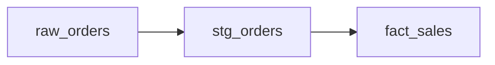

- # fabric-analytics-portfolio
- This project is to provide a practical example to practice using github.
- I'm using this project to prepare for taking the GitHub Foundations exam GH-900 GitHub Foundations.

- Status: learning Git

| model name |
|:-----------|
|dim_date    |
|stg_customer|
|stg_orders  |

- [ ] Write portfolio README
- [ ] Add CI for SQL linting

